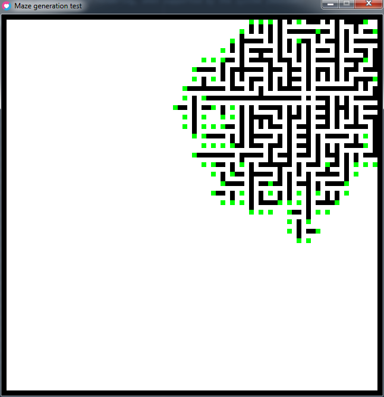
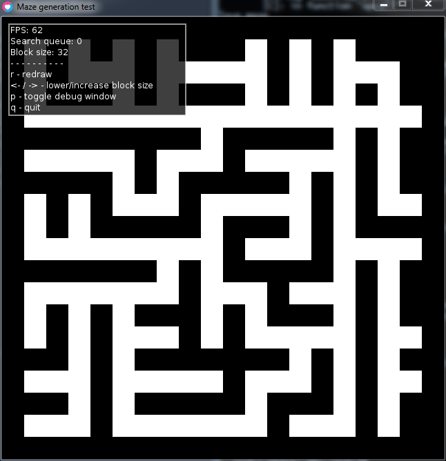

# Maze Generator

## Generate procedural mazes with Prim's algorithm

Maze actively generating  

Completed maze, with big block size and debug overlay  

Helpful links:

* [Maze Generation on Wikipedia](https://en.wikipedia.org/wiki/Maze_generation_algorithm)
* [Prim's Algo on StackOverflow](https://stackoverflow.com/questions/29739751/implementing-a-randomly-generated-maze-using-prims-algorithm)
* [Prim's Algo on dev blog](http://weblog.jamisbuck.org/2011/1/10/maze-generation-prim-s-algorithm)
